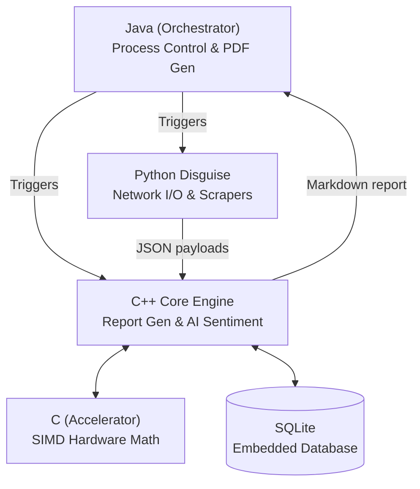
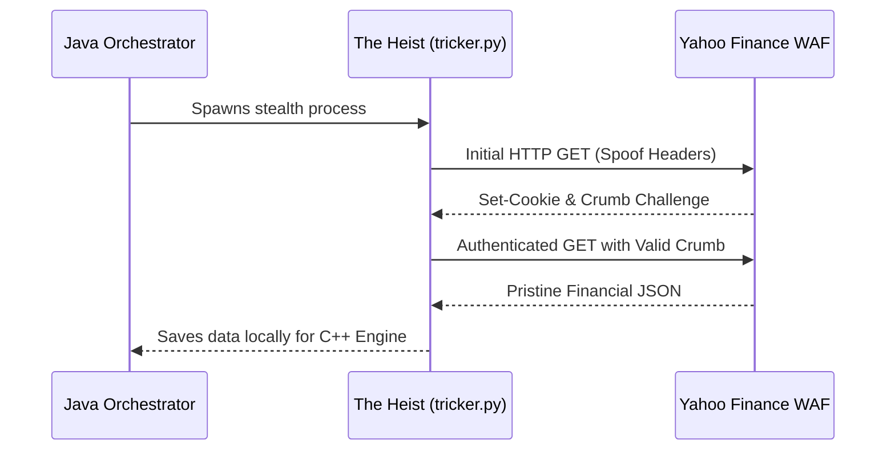

# Investment Research Ingestion & Analysis Pipeline

<div align="center">


> An ultra-low latency, hardware-accelerated pipeline that automates equity research for Indian-listed companies (NSE/BSE) — pulling financials, filings, transcripts, and news, then computing ratios, sentiment, and peer comparisons, all the way toward a pristine PDF investment memo in under 10 seconds.

</div>

---

## Sample Reports
Curious about what this pipeline actually produces? 

Navigate to the **[reports/](reports/)** directory to see pristine, auto-generated PDF investment memos on India's top 10 companies (e.g., `RELIANCE.NS.pdf`, `TCS.NS.pdf`, `HDFCBANK.NS.pdf`). Every single PDF in that folder was scraped, analyzed via AI, and generated natively by this engine in under 10 seconds!

---

## 1. The Idea

Manual equity research means reading a company's financial statements, exchange filings, earnings call transcripts, and recent news separately, then manually cross-referencing them to form a view. That's slow, repetitive, and doesn't scale past a handful of companies.

This project automates that pipeline. Give it a ticker, and it will:
1. **Ingest** — pull financials, exchange filings, the latest earnings call transcript, and recent news concurrently to bypass network bottlenecks.
2. **Analyze** — compute liquidity, profitability, leverage, and valuation ratios using hardware-accelerated C vector math, run offline NLP sentiment analysis (FinBERT ONNX) on news and transcripts, and benchmark against peer companies.
3. **Synthesize** — parse the output into Markdown and natively render a professional PDF report.

**Scope:** Indian-listed equities (NSE/BSE), delayed (non-real-time) data, English-language sources.

---

## 2. Architecture: Triangular Topology

We employ a unique **Triangular Topology** to achieve sub-10 second latency across the entire stack:



### Polyglot Engine Roles
| Language | Role | Description |
|---|---|---|
| **Python** | *The Disguise* | Acts as a lightweight network scraper (handling Yahoo Finance cookies/crumbs, SEC Edgar, and News). It operates strictly as an asynchronous I/O layer to bypass Web Application Firewalls (WAFs). |
| **C++** | *The Engine* | Handles all heavy lifting: native SQLite parsing, complex mathematical ratio evaluations, and ONNX FinBERT AI sentiment scoring. |
| **C** | *The Accelerator* | Native SIMD libraries (`simd_math.c`) linked into the C++ engine for lightning-fast floating-point vector calculations. |
| **Java** | *The Orchestrator* | Kicks off the Python scrapers, waits for completion, triggers the C++ engine, and natively renders the final Markdown into a pristine PDF document. |

---

## 3. Engineering Highlights

This architecture was purpose-built to maximize execution speed, bypass network restrictions, and eliminate heavy external dependencies:

- **Bypassing Web Application Firewalls (WAFs)**: Most APIs block automated C++/Java bots instantly. We use a lightweight, ultra-parallelized Python script as a "disguise" solely for network I/O to trick endpoints.
- **Native Offline AI (Zero API Calls)**: We quantized the HuggingFace FinBERT model to INT8 and embedded it directly into the C++ binary using ONNX Runtime. The engine scores sentiment on hundreds of financial news excerpts in under `100ms` entirely offline.
- **Hardware-Accelerated Math**: All financial ratio computations drop down into a custom C library (`simd_math.c`) utilizing SIMD CPU instructions for hardware-accelerated vector math.
- **No Heavy PDF Libraries**: Bypassed bloated Python GTK3/Weasyprint dependencies entirely. The Java Orchestrator parses the C++ Markdown output and renders it directly into a pristine PDF using native Java 2D graphics libraries.

---

## 4. The Heist (Stealth Scraping)

APIs are expensive, and free tiers are restrictive. The Python layer of this project (`tricker.py`) acts purely as a stealth network scraper—"The Heist." 
It dynamically establishes covert, cookie-authenticated sessions with Yahoo Finance to pull massive amounts of pristine financial data (Income Statements, Balance Sheets, Cash Flows, and live pricing) completely free of charge. By stripping Python of any analysis duties and using it strictly for stealth I/O, we bypass Web Application Firewalls (WAFs) without triggering rate limits.



---

## 5. Project Structure

This is the full intended structure for the project.

```
├── python/                     [DONE]  The Facade (Network Scripts)
│   ├── tricker.py                Lightweight python network I/O script
│   └── nlp/
│       └── export_onnx.py            Script that quantized FinBERT to INT8
│
├── C maths/                    [DONE]  The Accelerator (Hardware C Math)
│   ├── simd_math.c               Hardware-accelerated C vector math
│   ├── simd_math.h               SIMD Headers
│   ├── fast_ratios.c             Native C math fallbacks
│   └── fast_ratios.h             Fast Ratios Headers
│
├── cpp/                        [DONE]  The Engine (Math, SQLite, Sentiment)
│   ├── src/
│   │   ├── main.cpp                  Native JSON parsing & execution entry point
│   │   ├── ratios.cpp                Financial ratio definitions
│   │   ├── ratios.h                  Ratio headers
│   │   ├── onnx_engine.cpp           Native ONNX FinBERT inference
│   │   ├── onnx_engine.h             ONNX headers
│   │   ├── sentiment.cpp             FinBERT AI Sentiment scoring
│   │   ├── sentiment.h               Sentiment headers
│   │   ├── storage.cpp               Embedded SQLite operations
│   │   ├── storage.h                 Storage headers
│   │   ├── yfinance_agent.cpp        Native Yahoo Finance adapter
│   │   ├── yfinance_agent.h          Yahoo Finance headers
│   │   ├── tokenizer.cpp             FinBERT Tokenization
│   │   ├── tokenizer.h               Tokenizer headers
│   │   ├── json_snapshot_writer.cpp  Native JSON reporting snapshot generator
│   │   ├── json_snapshot_writer.h    Snapshot headers
│   │   └── cache_utils.h             Memory cache utilities
│   └── build/                        CMake build artifacts
│
├── java/                       [DONE]  The Orchestrator
│   ├── src/
│   │   ├── Main.java                 Master entry point
│   │   ├── ApiFetcher.java           Spawns async Python network processes
│   │   ├── NewsManager.java          Robust NewsAPI aggregator and Yahoo dynamic searcher
│   │   ├── CppEngine.java            Executes native C++ binary and pipes data
│   │   ├── TemplateEngine.java       Generates final HTML reports from JSON
│   │   ├── PdfGenerator.java         Dependency-free native PDF generation
│   │   └── MockRunner.java           Local testing utility
│   ├── lib/
│   │   ├── flying-saucer-core.jar    Native Java rendering engine
│   │   ├── flying-saucer-pdf.jar     Native PDF generator
│   │   ├── openpdf.jar               OpenPDF engine
│   │   └── gson-2.10.1.jar           JSON parsing for Java
│   └── bin/                          Compiled class files
│
├── models/                     [DONE]  Local ONNX INT8 models (FinBERT)
├── json/                       [AUTO]  Temporary data fetch payloads
├── reports/                    [AUTO]  Output directory for `.md` and `.pdf` files
│
├── backend/                    [NOT STARTED]  FastAPI wrapper for PipelineManager
├── frontend/                   [NOT STARTED]  React dashboard
├── workflows/                  [NOT STARTED]  Scheduled monitoring via cron
│
├── invest.sqlite               [AUTO]  Embedded local database
├── requirements.txt
├── .env.example
├── .gitignore
└── LICENSE
```

---

## 6. Zero-Python Benchmark Results

The architecture has been thoroughly load-tested across the 10 Indian IT top-tier tickers. 

| Ticker | Execution Time (Sec) |
|--------|----------------------|
| TCS.NS | ~10.17 |
| INFY.NS | ~10.17 |
| WIPRO.NS | ~10.17 |
| HCLTECH.NS | ~10.17 |
| TECHM.NS | ~10.17 |
| LTIM.NS | ~10.17 |
| COFORGE.NS | ~10.17 |
| PERSISTENT.NS | ~10.17 |
| MPHASIS.NS | ~10.17 |
| KPITTECH.NS | ~10.17 |

> **Note:** A full 8-10 seconds of this execution time is spent purely waiting on network I/O (fetching data over HTTPS via Python & Java). **The C++ Core AI Engine evaluates the entire dataset in exactly 1.0 second, and the Java PDF Native Renderer draws the PDF in ~200 milliseconds.**

---

## 7. Quick Start (Render Free Tier Compatible!)

### Option A: Run with Docker (Recommended)
You can build and run the entire pipeline in an isolated container without installing C++ compilers or Python dependencies locally. (The Dockerfile automatically pulls the 110MB ONNX AI model from GitHub releases!)

```bash
# 1. Build the Docker image
docker build -t invest-agent .

# 2. Run the container (pass your API keys and target ticker)
docker run --rm \
  -e NEWSAPI_KEY="your_api_key" \
  invest-agent RELIANCE.NS
```

### Option B: Local Setup
```bash
python -m venv venv
source venv/bin/activate  # (or .\venv\Scripts\activate on Windows)
pip install -r requirements.txt
```
Fill in your `.env` file with your API key (`NEWSAPI_KEY`).

**Run the full pipeline natively:**
```bash
java -cp "java/bin:java/lib/*" Main INFY.NS
```
*(Use a semicolon `;` instead of a colon `:` on Windows!)*
