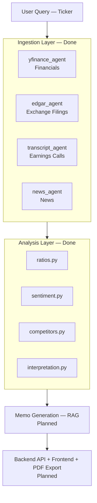
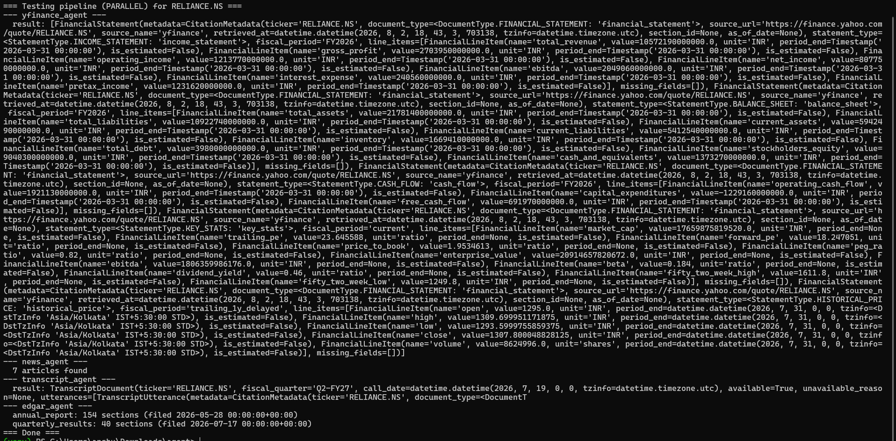
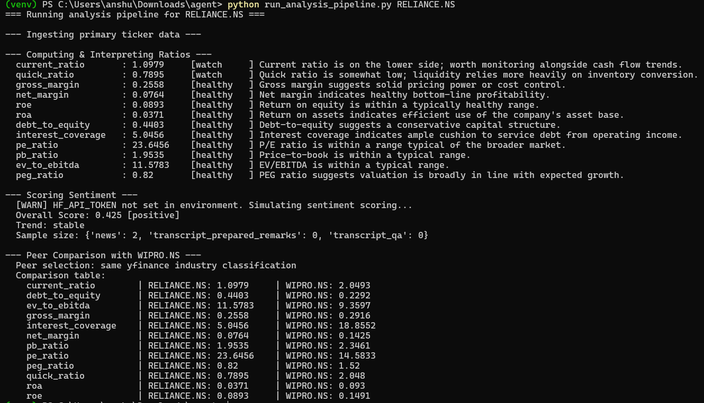

# Investment Research Ingestion & Analysis Pipeline

> An AI-powered pipeline that automates equity research for Indian-listed companies (NSE/BSE) — pulling financials, filings, transcripts, and news, then computing ratios, sentiment, and peer comparisons, all the way toward a fully cited investment memo.

---

## 1. The Idea

Manual equity research means reading a company's financial statements, exchange filings, earnings call transcripts, and recent news separately, then manually cross-referencing them to form a view. That's slow, repetitive, and doesn't scale past a handful of companies.

This project automates that pipeline: give it a ticker, and it will:
1. **Ingest** — pull financials, exchange filings, the latest earnings call transcript, and recent news, all tagged with source metadata (URL, date, section) so every downstream number or claim stays traceable.
2. **Analyze** — compute liquidity/profitability/leverage/valuation ratios, run sentiment analysis (FinBERT/TextBlob) on news and transcripts, and benchmark against 2–3 peer companies.
3. *(Planned)* **Synthesize** — generate a narrative investment memo where every claim is grounded in and cited back to a specific retrieved source, with a verification pass that flags anything unsupported.

**Scope:** Indian-listed equities (NSE/BSE), delayed (non-real-time) data, English-language sources, most recent 1–2 fiscal years of filings.

The system is built as a set of independent agents, each owning one stage of the pipeline, communicating through shared Pydantic schemas so no agent has to guess another's output shape.

---

## 2. Architecture



---

## 3. Tech Stack

| Layer | Technology | Status |
|---|---|---|
| Data ingestion | yfinance, BSE/exchange scraping, Motley Fool scraping, NewsAPI | Built |
| Shared data contracts | Pydantic | Built |
| Analysis | Pandas, NumPy, FinBERT (Hugging Face) / TextBlob | Built |
| Storage | PostgreSQL | Schema + write functions built |
| Memo synthesis (RAG) | LLM API (Claude/Gemini) — planned | Not started |
| Orchestration | LangGraph — planned | Not started |
| Backend API | FastAPI — planned | Not started |
| Frontend | React, TypeScript — planned | Not started |
| Scheduling | n8n (self-hosted, Docker) — planned | Not started |

---

## 4. Project Structure

This is the full intended structure for the project, not just what exists today. Each top-level folder is marked with its current status.

```
├── ingestion/                 [DONE]  Data Ingestion layer — all 4 agents working
│   ├── schemas.py                    Strict data contracts (citation metadata, doc types)
│   ├── storage.py                    PostgreSQL persistence layer + DDL schemas
│   ├── yfinance_agent.py             Financial statements & market data (yfinance)
│   ├── edgar_agent.py                Exchange filing scraper (BSE)
│   ├── news_agent.py                 News aggregation (NewsAPI) + dedup/relevance filter
│   ├── transcript_agent.py           Earnings call transcripts (Motley Fool scraping)
│   └── utils.py                      Retry logic, caching, rate limiting
│
├── analysis/                  [DONE]  Analysis & NLP layer — fully implemented & tested
│   ├── schemas.py                    Shared output contracts (RatioResult, SentimentResult, etc.)
│   ├── ratios.py                     Liquidity / profitability / leverage / valuation ratios
│   ├── sentiment.py                  FinBERT / TextBlob sentiment scoring
│   ├── competitors.py                Peer selection & side-by-side comparison
│   ├── interpretation.py             Threshold-based healthy/watch/concerning evaluation
│   └── utils.py                      Financial & metadata adapter utilities
│
├── rag/                        [NOT STARTED]  Memo Generation layer
│   ├── schemas.py                    Shared output schemas — memo + citation map contract
│   ├── chunking.py                   Section-aware / speaker-turn-aware document chunking
│   ├── embeddings.py                 Embedding model + vector store integration
│   ├── retrieval.py                  Per-section retrieval logic
│   ├── memo_generator.py             LLM prompt template + citation-grounded synthesis
│   ├── verification.py               Faithfulness check: claim-to-source verification
│   └── utils.py                      Citation ID mapping, formatting helpers
│
├── backend/                    [NOT STARTED]  Orchestration & API layer
│   ├── main.py                       FastAPI app entry point
│   ├── routes/                       POST /research, GET /research/{job_id}, etc.
│   ├── orchestration/                LangGraph pipeline wiring ingestion, analysis, rag together
│   └── db/                           Shared PostgreSQL connection/session handling
│
├── frontend/                   [NOT STARTED]  React dashboard
│   ├── src/                          Ticker search, cited memo display, charts
│   └── ...                           PDF export, comparison/sentiment visualizations
│
├── workflows/                  [NOT STARTED]  Scheduled monitoring
│   └── watchlist_monitor.json        n8n workflow: schedule trigger, POST /research per ticker
│
├── tests/                      [PARTIAL]  Unit test suite — 26 passing (ingestion + analysis only)
├── pipeline_test.py             [DONE]  Parallel smoke test across all ingestion agents
├── run_analysis_pipeline.py     [DONE]  End-to-end entry point: ticker in, analysis out
├── requirements.txt
├── .env.example
└── .gitignore
```

---

## 5. Work Done

**Ingestion layer — all 4 agents implemented and confirmed working:**
- `yfinance_agent.py` — pulls income statement, balance sheet, cash flow, key stats, and price history; normalizes into the shared schema; confirmed working against real tickers.
- `edgar_agent.py` — resolves company/scrip codes and fetches filing text from BSE; HTML cleaning and section-splitting fixed and confirmed against real filings.
- `transcript_agent.py` — scrapes Motley Fool earnings-call transcripts, structured by speaker (prepared remarks vs. Q&A); confirmed end-to-end with real, correctly speaker-attributed output.
- `news_agent.py` — pulls, dedupes, and relevance-filters recent articles via NewsAPI; every retained article carries a resolvable source URL.

**Analysis layer — fully implemented and tested:**
- `ratios.py`, `sentiment.py`, `competitors.py`, `interpretation.py` all built and passing tests.

**Shared infrastructure:**
- Citation-preserving Pydantic schemas across both layers (`ingestion/schemas.py`, `analysis/schemas.py`).
- PostgreSQL storage layer that preserves every citation-critical field (source, section, date, URL) end to end.
- Retry/caching/rate-limiting utilities for all external API calls.
- Full pytest suite passing.
- `run_analysis_pipeline.py` — single entry point running ingestion through analysis end to end for a given ticker.
- `pipeline_test.py` — standalone parallel smoke test across all four ingestion agents.

---

## 6. Sample Run — RELIANCE.NS

End-to-end smoke test run against `RELIANCE.NS`, covering both the ingestion and analysis layers:

**Ingestion output:**



**Analysis output:**



---

## 7. Remaining

- **Memo Generation Agent (RAG)** — chunk/embed ingested documents, retrieve relevant passages per memo section, generate narrative text with inline citations, and run a verification pass to flag/remove unsupported claims. Not started.
- **Backend orchestration** — FastAPI service wrapping the pipeline behind `POST /research`, `GET /research/{job_id}`, etc., with LangGraph coordinating agent runs. Not started.
- **Frontend dashboard** — React UI for ticker search, cited memo display, and comparison/sentiment charts. Not started.
- **PDF report export.** Not started.
- **Scheduled monitoring (n8n)** — Schedule Trigger to HTTP call to backend per watchlisted ticker, with notification on significant changes. Designed on paper, not implemented.
- **Deployment** — hosting stack (Vercel/Render/Supabase/Oracle Cloud) not yet set up; everything currently runs locally.

---

## 8. Known Limitations

- BSE's announcements endpoint (`edgar_agent.py`) still returns "No Record Found" regardless of parameters tried — likely needs an undocumented required parameter only visible via browser DevTools inspection of BSE's live frontend requests. Documented blocker, not yet resolved.
- `news_agent.py`'s relevance filter is a simple substring match on ticker/company name — lets through some non-financial noise (e.g. unrelated mentions). Would need entity-linking for real precision; accepted as a known tradeoff for now.
- `edgar_agent.py`'s filing section-splitting returns fewer sections for 10-Q-equivalent filings than for annual filings — not yet confirmed whether that reflects the source document structure or a remaining parsing gap.

---

## 9. Quick Start

### Setup
```powershell
python -m venv venv
.\venv\Scripts\activate
pip install -r requirements.txt
cp .env.example .env
```
Fill in `.env` with your API keys (`NEWSAPI_KEY`, `HF_API_TOKEN` for FinBERT, `DATABASE_URL` for PostgreSQL).

### Run the full pipeline
```powershell
python run_analysis_pipeline.py INFY.NS
```
This ingests financials/filings/transcript/news for the ticker, computes ratios and sentiment, and compares against an auto-selected peer (e.g. `WIPRO.NS`).

### Testing
```powershell
pytest                          # unit test suite
python pipeline_test.py RELIANCE.NS   # parallel smoke test across all ingestion agents
```

---

## 10. Component Documentation

- [Data Ingestion Agent Details](ingestion/README.md)
- [Analysis & NLP Agent Details](analysis/README.md)
